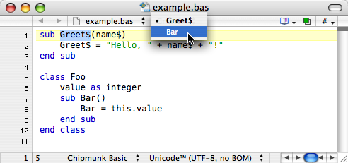
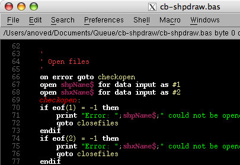
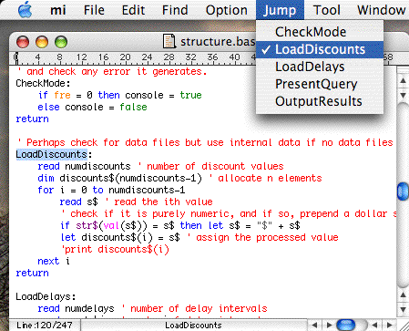

# Chipmunk Basic Syntax Coloring

## TextWrangler/BBEdit

[`cbastw.plist`](cbastw.plist)

Rudimentary syntax module for [BBEdit](http://www.barebones.com/products/bbedit/) or [TextWrangler](http://www.barebones.com/products/textwrangler/). Put the plist file in your `~/Library/Application Support/BBEdit/Language Modules/` folder. Named subroutines are listed in the function popup menu.

## NEdit

[`cbasene.nedit`](cbasne.nedit)

Syntax pattern recognition configuration for the old X11 text editor [NEdit](http://www.nedit.org/). Save and integrate with your NEdit configuration file using the command `nedit -import cbasene.nedit`, then select `Save Defaults` from the `Preferences` menu.

## Mi

[`cbasmi.zip`](cbasmi.zip)

Chipmunk Basic syntax mode for the text editor [Mi](http://www.mimikaki.net/en/). Put the expanded folder in `~/Library/Preferences/mi/mode/`. Recognizes files, basic keywords, named subroutines, and `gosub` labels.
