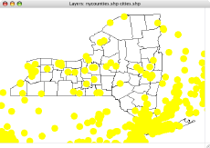

# CB Shapedraw

## An ESRI Shapefile renderer implemented in Chipmunk Basic

This Chipmunk Basic program parses ESRI [shapefiles](http://www.esri.com/library/whitepapers/pdfs/shapefile.pdf) (PDF) and draws their contents to the Chipmunk Basic graphics window. It supports *point*, *multipoint*, *polyline*, and *polygon* shape types. Multiple shapefiles can be drawn together using different line weights and colors, allowing simple map overlays to be constructed.

 

## Speed and Significance

Although `cb-shpdraw` is very slow and has little practical utility, it is the only freely available way I currently know of to display shapefiles on old 68k Macs such as the PB 540c used for the Classic screenshots on this page. It is a couple orders of magnitude slower on the 33MHz 68LC040 than on my 1.2GHz G4 (as in half an hour versus half a second)! But that is OK, as it is mainly a "can it be done?" program, not an actual tool.

## Interface

The current interface is crude. Here is an example command transcript and its output (`>` is the Chipmunk Basic console prompt):

 

	>run Enter window width: 600
	Enter window height: 400
	Enter window color (r,g,b percents): 100,100,100
	Specify shapefile (none to stop): nycounties
	Symbol color (r,g,b percents): 0,0,0
	Symbol size (>=1): 1
	Rendering polyline or polygon shapefile
	Specify shapefile (none to stop): cities
	Symbol color (r,g,b percents): 100,100,0
	Symbol size (>=1): 20
	Rendering multipoint shapefile
	Specify shapefile (none to stop):
	> 

The shapefile names stated above are the names of shapefiles residing in the same directory as the `cb-shpdraw.bas` program. To reference a shapefile in a different folder you have to enter its path. On Mac OS X, that looks like this:

	Specify shapefile (none to stop): /Users/anoved/Documents/Geo/shapefile.shp 

On earlier systems, I believe the directory separator is the colon (`:`).

## Shapefile names

Shapefiles actually consist of three separate files: a `.shp` file containing the coordinate data, a `.shx` file that provides an index to the coordinate data for each shape, and a `.dbf` file that contains attributes associated with each shape. Each part of a complete shapefile has the same prefix. When specifying a shapefile for `cb-shpdraw`, you may provide the name of the `.shp` file, the `.shx` file, or the shapefile prefix alone. The program doesn't do anything with attribute files and doesn't even require them to be present.

## Scaling and Coordinate Systems

The first shapefile rendered establishes the scale used for all subsequent layers. It is stretched to fit within the requested window dimensions, and the formula used to convert its geographic coordinates into screen coordinates is applied to any additional layers. This only results in meaningful overlays (such as the examples pictured above) if the shapefiles use the same coordinate system (latitude/longitude or UTM, for instance). Mixing coordinate systems is no problem in a real GIS that can reproject layers on the fly, but `cb-shpdraw` doesn't know anything about projections, let alone translating them dynamically.

## Nifty features

Although cb-shpdraw doesn't do much itself, the code does demonstrate how to do a couple interesting things with Chipmunk Basic.

- unnumbered lines
- catching and handling `open` errors using `on error` (the `open` command's optional "`else goto`" error handler appears to be incompatible with labelled goto targets; it'll only go to a hard-coded line number – blah!)
- use of the `fseek` command to navigate around a file (not put to terribly effective use in `cb-shpdraw` as the shapes are drawn sequentially anyway, but in place to facilitate future modifications where particular shapes are requested but not others – possibly according to attribute values)
- use of named subroutines
- parsing of a fairly complex binary file format – in accordance with ESRI's specification, shapefiles contain a combination of "big endian" and "little endian" byte ordering. This means that some values are stored "backwards" (most, actually, relative to the Mac's native "big endian" byte order), which is the reason for the byte-by-byte math in the `Read` subroutines. Otherwise, input could probably be lots faster, using `get` to read a typed structure directly from file. Maybe that's possible anyway. Regardless, figuring out how to read a little-endian eight-byte double with Chipmunk Basic seemed pretty tricky.

## Download

[`cb-shpdraw.bas`](cb-shpdraw.bas)

[`cb-shpdump.bas`](cb-shpdump.bas)

cb-shpdump is cb-shpdraw's textual predecessor. It does what [Shapelib's](http://shapelib.maptools.org/) [`shpdump`](http://shapelib.maptools.org/shapelib-tools.html#shpdump) program does, only slower! The code is very similar to cb-shpdraw's, except coordinate data is printed to the console instead of drawn in the graphics window. Only interesting difference is it's compatible with the OS X command-line version of Chipmunk Basic (runs much faster than in the windowed version). Appropriately, the first argument is an obscure "mode" string, where `h` means to print the file header, `s` means to print each shape's header, and `g` means to print all the geographic coordinates for each shape. So, `cb-shpdump h shapefile.shp` just displays the file header, while `cb-shpdump hsg shapefile.shp` prints everything.

---

  

---

>run Enter window width: 800 Enter window height: 600 Enter window color (r,g,b percents): 0,0,0 Specify shapefile (none to stop): WorldLocs_point Symbol color (r,g,b percents): 100,100,0 Symbol size (>=1): 2 Rendering single-point shapefile
