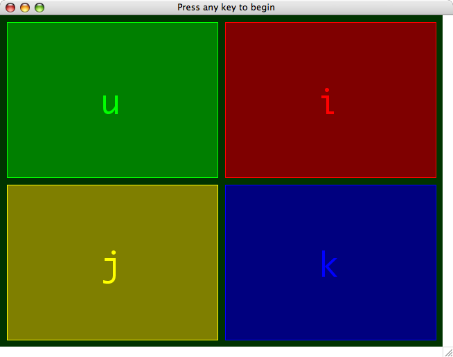
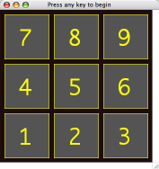
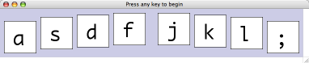

# Simon Says in Chipmunk Basic

This is a simple version of Simon Says written in Chipmunk Basic. The game is played by attempting to repeat the pattern played by the computer. Each time you successfully mimic the computer's play, the pattern is lengthened.

The game is playable but is primarily intended as an example. There are some rough edges. The game may become confused if you hold down keys too long or type too rapidly.

## Download

[`cbsimon.bas`](cbsimon.bas)_

## Layouts

The layout and some of the behavior of the game "board" is read from `data` statements at the end of the program. The layout defines the number of game panels, their size and position, their colors, the notes heard when they are played, and the keys associated with them. The default layout is shown in the screenshot above, but others are included:

To use these or other layouts, comment out the default `data` statements and uncomment or insert the desired layout data.

## Layout Data

The `data` listed in `cbsimon.bas` is condensed. When editing or creating your own `data`, you’ll probably want to make better use of white space and separate `data` statements to group related items, as in `cbsimon_data.bas`. It’s also helpful to give each panel a different color (unlike the included alternates).

Here is the meaning of each layout `data` item:

1. width of window
2. height of window
3. window background color % red
4. window background color % green
5. window background color % blue
6. duration of computer panel flash (seconds)
7. duration of pause between computer panel flashes (seconds)
8. duration of pause between turns (seconds)
9. duration of player panel flash (seconds)
10. MIDI “voice” for sounds (instrument ID; piano is 1)
11. thickness of game over highlights
12. wrong panel highlight % red
13. wrong panel highlight % green
14. wrong panel highlight % blue
15. right panel highlight % red
16. right panel highlight % green
17. right panel highlight % blue
18. number of panels

The following series of data items is then repeated for each game panel:

1. panel upper left X coordinate
2. panel upper left Y coordinate
3. panel bottom right X coordinate
4. panel bottom right Y coordinate
5. inactive panel color % red
6. inactive panel color % green
7. inactive panel color % blue
8. active panel color % red
9. active panel color % green
10. active panel color % blue
11. MIDI “key” ([musical notes to MIDI keys](http://www.midisolutions.com/Figure35.jpg), [frequencies to MIDI keys](http://www.borg.com/~jglatt/tutr/notefreq.htm))
12. keyboard key
